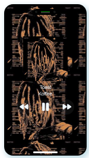

# IPhone 14 UI - Fun Prject With Calculator and Music player App all in One

This is an Update I made for the [Phone UI](https://www.frontendmentor.io/challenges/space-tourism-multipage-website-gRWj1URZ3) Project ! worked on in Jul/Aug 2022.

## Table of contents

- [Overview](#overview)
  - [The update](#the-update)
  - [Screenshot](#screenshot)
  - [Links](#links)
- [My process](#my-process)
  - [Built with](#built-with)
  - [What I learned](#what-i-learned)
  - [Continued development](#continued-development)
  - [Useful resources](#useful-resources)
- [Author](#author)
- [Acknowledgments](#acknowledgments)

## Overview

### The update

- I added a scroll-to-home feature to add the feels of using an actual Iphone
- I update the camera structure to look like the Iphone 14
- Added some new calculator functionalities
- Refactored some JS functions

### Screenshot

Home Page

Iphone Calculator

Music player

Author's Information

### Links

- Solution URL: [Git Link](https://github.com/Cross-companion/space-tourism-app)
- Live Site URL: [Live Site](https://space-tourism-app-omega.vercel.app)

## My process

### Built with

- Semantic HTML5 markup
- CSS custom properties
- Flexbox
- Mobile-first workflow(of Course😅)
- Vanilla Javascript

### What I learned

Building this project thought me alot about the execution processes of Javascript code, the use of audio, and Images, dates and time, javascript operator Precedence and much more.

### Continued development

Going on From Here, I would continue my Learning learnings with React and Next.js to complete my MERN stack goal.

## Author

- Website - Nwodoh Daniel
- Frontend Mentor - [@Cross-companion](https://www.frontendmentor.io/profile/Cross-companion)
- Twitter - [@Cross_companion](https://www.twitter.com/Cross_companion)
